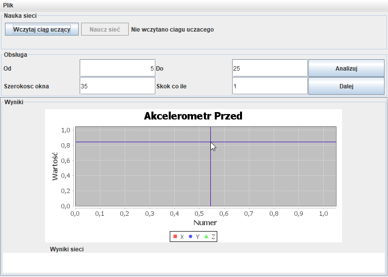

# Shimmer Romb
> Project using [Shimmer](https://www.shimmersensing.com/) and neural networks Developed in 2014. 
 
Prototype of Andorid app that connects throught bluetooth with Shimmer and using trained neural network that tells us weather the person wearing Shimmer is Standing, Running,Jumping Sitting or laying down.

Source and Showcase are for desktop application that were used to analize Shimmer outputs and training neural networks.

## Showcase:

### Technologies
Java,Android, Bluetooth,Weka
